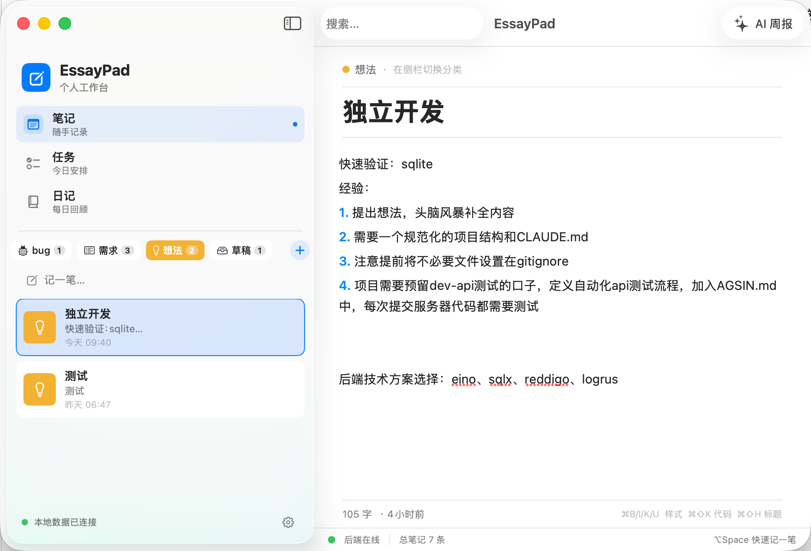
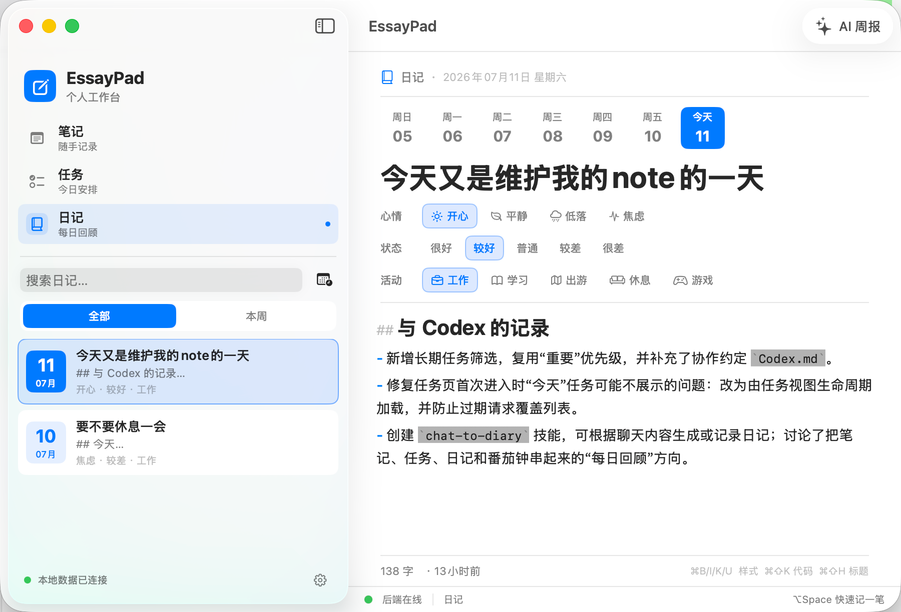
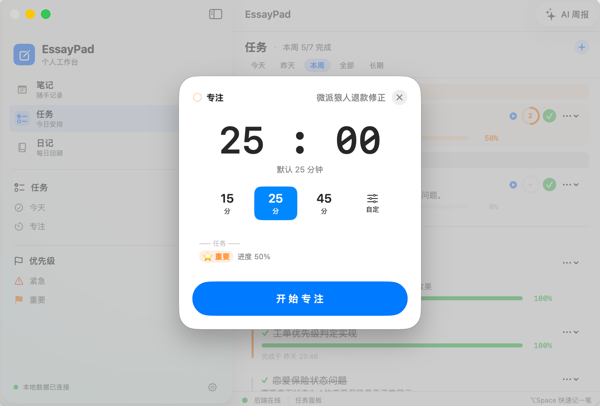

# EssayPad - 随笔管理

> mac 客户端 + Go 后端的轻量随笔管理。常驻悬浮小窗 + 全局快提键,捕获灵感不打断手头的事;三类分类 + Markdown + AI 周报,周回顾也省心。

## 产品预览

### 快速记录与内容管理

<p>
  
  
  
</p>

### 任务与专注

<p>
  
</p>

### AI 周报


---

## 项目架构

### 总体形态

```
┌──────────────────────────────────────────────────────────┐
│                  EssayPad.app (SwiftUI)                  │
│                                                          │
│  ContentView ── ModeSwitcher                             │
│     │                                                    │
│     ├── NoteListView / NoteEditorView   (笔记主流程)    │
│     ├── TasksView / TaskDetailView      (任务)           │
│     ├── WeeklyReportView                (AI 周报)        │
│     ├── AISettingsView                  (设置)           │
│     └── PomodoroWindowController        (番茄钟浮窗)     │
│                │                                         │
│                ▼                                         │
│           APIClient (actor, 127.0.0.1:18888)             │
└──────────────────────────┬───────────────────────────────┘
                           │ HTTP / JSON
                           ▼
┌──────────────────────────────────────────────────────────┐
│             Go Server (Gin, 单进程 18888)                │
│                                                          │
│  router ──┬── handler/note.go                             │
│           ├── handler/task.go                            │
│           ├── handler/pomodoro.go                        │
│           ├── handler/weekly.go   (AI 周报入口)          │
│           ├── handler/config.go   (AI 运行时配置)        │
│           └── handler/util.go                            │
│              │                                           │
│              ▼                                           │
│  service/  (业务编排:WeeklyService 拉 note + task)       │
│  store/    (DAO:note_dao / task_dao / pomodoro_dao)      │
│  ai/       (OpenAI 兼容 client + eino + Stats)           │
│              │                                           │
│              ▼                                           │
│        SQLite (./data/essaypad.db, 单文件)               │
└──────────────────────────────────────────────────────────┘
```

### 设计原则

- **本地优先**:后端只跑 `127.0.0.1`,外网不可达;SQLite 单文件,易备份易迁移。
- **mac 端是主力,后端最小化**:数据校验 / 业务编排都放 mac 端,后端只负责存储和 AI 转发。
- **AI 配置运行时可变**:`PUT /api/v1/ai-config` 实时切换,无需重启服务。
- **零客户端依赖**:mac 端不引入 SPM / Podfile,所有能力手写实现。
- **任务时长 SQL 实时算**:`SUM(actual_minutes)` 直接查,不在 Go 内存里维护副本。

### 数据模型

详见 `docs/storage.md`。简表:

| 表 | 用途 | 关键字段 |
|---|---|---|
| `notes` | 笔记 (bug/需求/想法) | category, title, content, updated_at |
| `tasks` | 任务 | title, progress, priority, status, due_at |
| `pomodoro_sessions` | 番茄钟记录 | task_id, planned_minutes, actual_minutes, status, started_at, ended_at |
| `weekly_reports` | AI 周报缓存 | preset, range_start, range_end, summary, highlights, action_items, note_count |

### 关键模块

**mac 端**(`mac/EssayPad/`):

| 目录 | 职责 |
|---|---|
| `Models/` | 数据模型(Note / TodoTask / PomodoroSession / NoteCategory) |
| `Network/` | APIClient(actor 单例) + Endpoints + APIError |
| `Store/` | NoteStore(@Observable, 跨视图状态) |
| `Views/` | 所有 SwiftUI 视图;按功能分文件,小视图就近定义 private struct |
| `Markdown/` | 简易 Markdown 解析 + 快捷键 |
| `Hotkey/` | Carbon 全局热键(⌥Space) |
| `Server/` | 本地后端健康探测 |
| `Utils/` | Keychain/UserDefaults 存储、图片粘贴、音效 |

**后端**(`server/`):

| 目录 | 职责 |
|---|---|
| `config/` | 环境变量加载 |
| `internal/model/` | 数据结构(纯结构体,无逻辑) |
| `internal/serializer/` | 统一响应格式 `{code, msg, data}` |
| `internal/store/` | DAO + SQLite 连接 + 建表迁移 |
| `internal/service/` | 业务编排层(weekly 拉 notes+tasks) |
| `internal/handler/` | HTTP handler,只做参数解析和返回 |
| `internal/ai/` | OpenAI 兼容 client、eino 集成、Stats 统计 |
| `internal/router/` | 路由注册 |

### AI 集成路径

```
用户按 "AI 周报" 
  → WeeklyReportView.generate()
  → APIClient.generateWeekly(preset)
  → POST /api/v1/weekly/generate
  → WeeklyHandler.Generate
  → WeeklyService.GenerateByMode (查 cache → 拉 notes+tasks → AI)
  → ai.Client.GenerateWeekly (eino 优先,失败回退 HTTP)
  → OpenAI 兼容 API
  → 解析 usage + JSON
  → 存 weekly_reports 表 (缓存)
  → 返回前端
  → 渲染总结/要点/行动
```

AI 配置单独接口:
- `PUT /api/v1/ai-config` —— 切换 baseURL / apiKey / model(运行时生效)
- `GET /api/v1/ai-config/stats` —— 调用量 + token 用量(prompt/completion/total)

### 快捷键一览

| 快捷键 | 行为 |
|---|---|
| `⌥ Space` | 全局呼出快提窗 |
| `⌘ /` | 弹出快捷键面板 |
| `⌘ ,` | 打开设置 |
| `⌘ N` | 新建笔记 |
| `⌘ F` | 聚焦搜索 |
| `⌘ ⇧ A` | 切换 AI 周报页 |
| `⌘ ⇧ P` | 开始专注(倒计时) |
| `⌘ ⇧ U` | 开始正计时 |
| `⌘ ⇧ R` | 开始 5 分钟休息 |

---

## 快速启动(已经跑通的方式)

### 一、启动后端(Go 服务,数据落地 SQLite)

```bash
cd /Users/Shared/lab_project/essaypad/server
./bin/essaypad &      # 后台启动,监听 127.0.0.1:18888
```

如果 `bin/essaypad` 不存在,先编译:

```bash
cd /Users/Shared/lab_project/essaypad/server
go build -o bin/essaypad .
```

**验证后端在跑:**

```bash
curl http://127.0.0.1:18888/health
# 预期返回: {"status":"ok"}
```

后端默认会:
- 在 `./data/essaypad.db` 创建 SQLite 文件
- 自动建表、自动迁移
- 监听 `127.0.0.1:18888`(本机回环,外网不可达)

**带 AI 周报(可选):**

```bash
ESSAYPAD_AI_BASE_URL=https://api.openai.com/v1 \
ESSAYPAD_AI_API_KEY=sk-你的key \
ESSAYPAD_AI_MODEL=gpt-4o-mini \
./bin/essaypad
```

### 二、启动客户端(已经手编好了)

.app 在 `~/Applications/EssayPad.app`,直接打开:

```bash
open ~/Applications/EssayPad.app
```

如果提示已损坏或被拒访问,重新签名一次:

```bash
codesign --force --deep --sign - ~/Applications/EssayPad.app
open ~/Applications/EssayPad.app
```

窗口出现后,客户端会先请求 `127.0.0.1:18888/health` 探测后端。后端没启动会显示「后端未启动」页面,点重试即可。

---

## 日常使用

### 三类分类

| 图标 | 名称 | 用途 |
|---|---|---|
| 🐞 bug | bug | 缺陷记录、线上问题、bug 复现 |
| 📋 list.bullet.rectangle | 需求 | 待办、需求、功能 TODO |
| 💡 lightbulb | 想法 | 灵感、点子、值得思考的问题 |

主窗口顶部 Picker 切换,左侧列表显示该分类下的所有随笔(按更新时间倒序)。

### 写一条随笔

**主窗口:**
1. 选好分类 → 点右上角 ➕
2. 填标题(必填)
3. 写正文,支持 Markdown
4. 切「预览」开关看渲染效果
5. ⌘S 保存(标题为空时按钮禁用)

**快速捕获(全屏也能用):**
- 任意位置按 **⌥Space**(Option + 空格)
- 弹出悬浮小窗,选分类 → 写标题 → 写内容 → ⌘↩ 保存
- 屏幕任意位置都能呼出,**包括全屏应用、看视频、写代码时**
- 再按一次 ⌥Space 关闭

### Markdown 快捷键

主窗口 Edit 菜单下:
| 快捷键 | 效果 |
|---|---|
| ⌘B | 加粗 `**` |
| ⌘I | 斜体 `*` |
| ⌘K | 链接 `[](url)` |
| ⌘⇧K | 行内代码 `` ` `` |
| ⌘⇧H | 二级标题 `## ` |

支持的基础语法(预览里看效果):
- 标题 `# / ## / ### / ...`
- 粗体 `**x**`、斜体 `*x*`
- 行内代码 `` `x` ``、代码块 ` ``` `
- 列表 `- ` / `* `
- 引用 `> `
- 链接 `[text](url)`

### AI 周报

1. 工具栏点 ✨ AI 周报
2. 进入周报页
3. 点右上角「生成」
4. 后端会拉近 7 天的所有随笔(bug/需求/想法),用 AI 总结成:
   - **总结**:一句话概括本周
   - **要点**:3-5 条亮点
   - **行动**:3-5 条下周可执行项
5. 几秒后出结果

AI 周报需要后端配了 `ESSAYPAD_AI_API_KEY`,否则会报 1001 错误。

### 全局 ⌥Space 不响应怎么办

需要授权辅助功能:
1. 系统设置 → 隐私与安全性 → 辅助功能
2. 点 ➕ → 选 `~/Applications/EssayPad.app`
3. 确认开启
4. 重启 EssayPad

---

## 关闭 & 重启

```bash
# 关闭客户端(优雅退出)
pkill -f "EssayPad.app/Contents/MacOS/EssayPad"

# 关闭后端
pkill -f "essaypad/server/bin/essaypad"

# 重启后端(后台)
cd /Users/Shared/lab_project/essaypad/server
nohup ./bin/essaypad > /tmp/essaypad.log 2>&1 &

# 重启客户端
open ~/Applications/EssayPad.app
```

**查看后端日志:**

```bash
tail -f /tmp/essaypad.log
```

---

## 数据存在哪

后端默认 `./data/essaypad.db`,SQLite 文件。WAL 模式下还有 `essaypad.db-wal` 和 `essaypad.db-shm` 两个辅助文件。

**备份数据:** 直接拷贝 `data/essaypad.db`(可以热备,SQLite 安全)。

**重置数据:** 删 `data/essaypad.db*` 三个文件,重启后端自动建新表。

**换机器:** 把 `essaypad.db` 拷过去即可(后期切 MySQL 时不能用这招)。

---

## 故障排查

| 现象 | 原因 | 解决 |
|---|---|---|
| 客户端显示「后端未启动」 | 后端没跑 / 端口被占 | `curl 127.0.0.1:18888/health` 验证;不行就重启后端 |
| AI 周报 1001 | 没配 AI key | 配 `ESSAYPAD_AI_API_KEY` 后重启后端 |
| 全局 ⌥Space 不响应 | 没授辅助功能 | 系统设置 → 辅助功能 → 加 EssayPad |
| 创建失败「invalid category」 | 分类值非 1/2/3 | 必现 bug,见后端日志(目前是 UI 限定,不会出) |
| 创建失败「title is required」 | 标题为空 | 填标题再保存 |
| `open EssayPad.app` 提示损坏 | 签名失效 | `codesign --force --deep --sign - ~/Applications/EssayPad.app` |
| 端口 18888 被占 | 其他程序占用 | `lsof -i :18888` 查谁在用,杀掉或换端口 `ESSAYPAD_PORT=18889 ./bin/essaypad` |

---

## 重新编译客户端

如果改了 Swift 源文件,需要重编 .app:

```bash
SRC=/Users/Shared/lab_project/essaypad/mac/EssayPad
APP=~/Applications/EssayPad.app
SDK=$(xcrun --sdk macosx --show-sdk-path)

# 1. 重新编译
xcrun swiftc \
  -target arm64-apple-macos14.0 \
  -sdk "$SDK" \
  -O \
  -o $APP/Contents/MacOS/EssayPad \
  $(find $SRC -name '*.swift' | sort)

# 2. 重新签名
codesign --force --deep --sign - $APP

# 3. 重启
pkill -f "EssayPad.app/Contents/MacOS/EssayPad" 2>/dev/null
open $APP
```

**重新编译后端:**

```bash
cd /Users/Shared/lab_project/essaypad/server
go build -o bin/essaypad .     # 不停服:先 stop 再 start
```

---

## 仓库布局

```
essaypad/
├── README.md                  # 本文件
├── docs/
│   ├── interface.md           # HTTP 接口协议
│   ├── storage.md             # 数据库表结构
│   └── ai-prompt.md           # AI 周报的 prompt 模板
├── server/                    # Go 后端
│   ├── main.go
│   ├── Makefile
│   ├── config/config.go
│   └── internal/{ai,handler,model,router,serializer,service,store}/
└── mac/                       # SwiftUI 客户端源码
    ├── EssayPad/
    │   ├── Models/            # Note, NoteCategory
    │   ├── Network/           # APIClient, Endpoints
    │   ├── Store/             # NoteStore (@Observable)
    │   ├── Views/             # 主窗口、快提窗、编辑器、列表、周报
    │   ├── Markdown/          # 解析器 + 快捷键
    │   ├── Hotkey/            # Carbon 全局热键
    │   └── Server/            # 后端健康探测
    └── EssayPadTests/
```

设计细节见 `docs/` 下三份文档(接口、存储、AI prompt)。

---

## 环境变量一览

| 变量 | 默认 | 说明 |
|---|---|---|
| `ESSAYPAD_PORT` | 18888 | 后端 HTTP 端口 |
| `ESSAYPAD_DB_PATH` | `./data/essaypad.db` | SQLite 文件路径 |
| `ESSAYPAD_AI_BASE_URL` | (空) | OpenAI 兼容 base URL,如 `https://api.openai.com/v1` |
| `ESSAYPAD_AI_API_KEY` | (空) | API key;不配则 AI 周报不可用 |
| `ESSAYPAD_AI_MODEL` | gpt-4o-mini | 模型名 |

可写到 `~/.zshrc`:

```bash
export ESSAYPAD_AI_BASE_URL=https://api.openai.com/v1
export ESSAYPAD_AI_API_KEY=sk-xxxx
export ESSAYPAD_AI_MODEL=gpt-4o-mini
```
